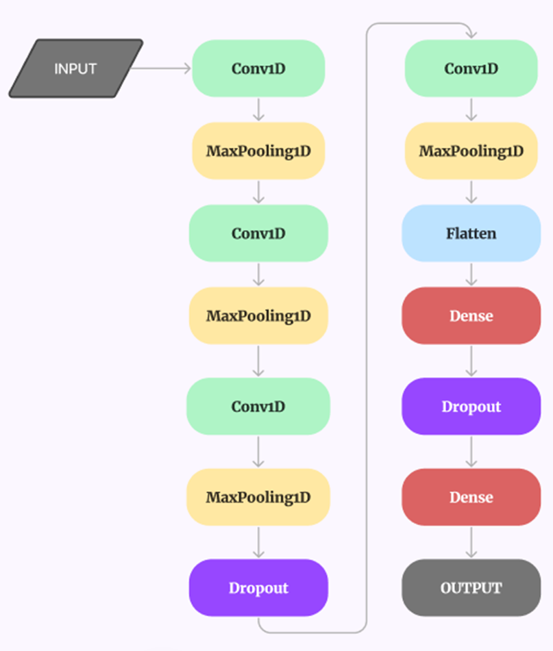
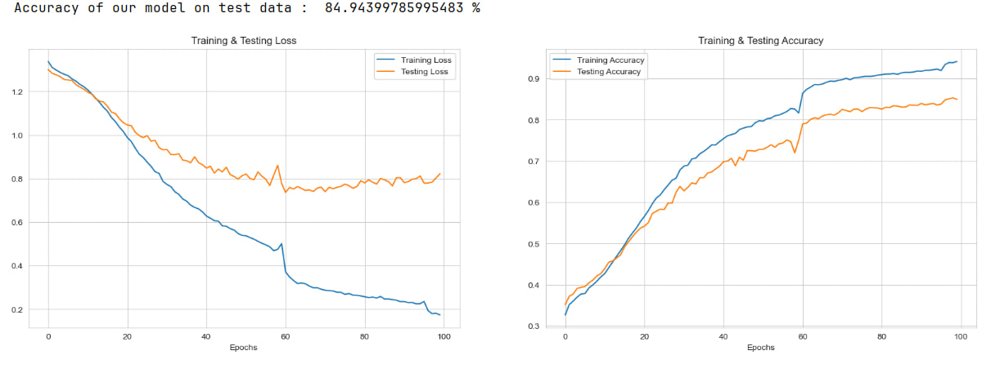
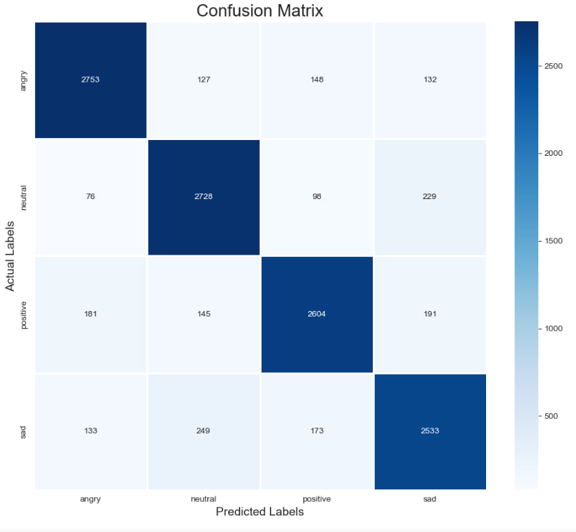
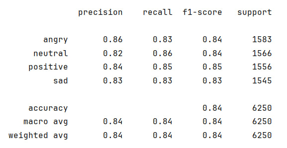

# Выпускная квалификационная работа

## Тема: "Распознавание эмоций в речи на русском языке"

Цель исследования - разработка эффективной модели SER (speech emotion recognition) для русской речи.

Задачи:
1.	Провести анализ существующих решений задачи определения эмоций человека по голосу.
2.	Произвести обзор датасетов для распознавания эмоций на русском языке.
3.	Построить систему автоматического определения эмоций человека на основе модели нейронной сети.
4.	Провести сравнение с существующими моделями State of the art          (SOTA).

### Стек
* Python
* DataSpell
* Keras
* Librosa
* Pandas
* Sklearn

### Датасет Dusha 
В ходе анализа существующих датасетов для определения эмоций в руской речи был выбран датасет [Dusha](https://developers.sber.ru/portal/products/dusha).
Самый большой открытый датасет для распознавания эмоций в устной речи на русском языке.
Длительность составляет около 350 часов аудио. Выделено 4 эмоции: радость, грусть, злость и нейтральная эмоция.

### Извлекаемые признаки из аудиосигналов

    1. Mel-spectrogram
    2. MFCC (мел-кепстральные коэффициенты)
    3. ZCR (частота пересечения нулевой линии аудиосигнала)

### Классификатор эмоций

Сверточная нейронная сеть из 13 слоев.

Обученные модели анализировали по метрикам:
* Presision
* Recall
* F1-score

### Результат
Комбинация всех трех признаков дала наилучший результат.
Лучшая модель достигла среднее гармоническое значение точности и полноты модели, равное 84,94%.

